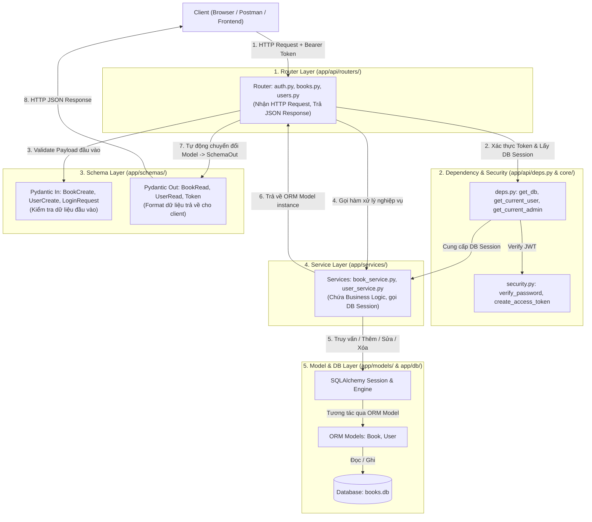

# TÀI LIỆU KIẾN TRÚC VÀ LUỒNG HOẠT ĐỘNG DỰ ÁN (Arche.md)

---

## 1. TỔNG QUAN DỰ ÁN

### 1.1. Project này dùng để làm gì?
Dự án này là một RESTful Backend API được xây dựng bằng **FastAPI** và **SQLAlchemy**, quản lý hệ thống **Sách (Books)** kết hợp với hệ thống **Người dùng (Users)**, xác thực bằng **JWT (JSON Web Token)** và phân quyền theo vai trò (**Role-Based Access Control - RBAC**).

### 1.2. Chức năng chính
1. **Quản lý Sách (Books CRUD):**
   - Xem danh sách sách (`GET /api/v1/books`) và chi tiết sách (`GET /api/v1/books/{id}`) - Công khai (Public).
   - Thêm sách mới (`POST /api/v1/books`) - Bắt buộc phải **đăng nhập** (User role bất kỳ).
   - Sửa sách (`PUT /api/v1/books/{id}`) - Chỉ **Admin** (`role = 0`) mới có quyền.
   - Xóa sách (`DELETE /api/v1/books/{id}`) - Chỉ **Admin** (`role = 0`) mới có quyền.
2. **Quản lý Người dùng (Users CRUD):**
   - Đăng ký / Tạo user (`POST /api/v1/users`) - Mã hóa mật khẩu bằng `bcrypt`.
   - Xem danh sách user (`GET /api/v1/users`) và xem chi tiết user (`GET /api/v1/users/{id}`).
   - Cập nhật user (`PUT /api/v1/users/{id}`) - Chỉ **Admin** mới có quyền.
   - Xóa user (`DELETE /api/v1/users/{id}`) - Chỉ **Admin** mới có quyền.
3. **Xác thực & Phân quyền (Auth & Security):**
   - Đăng nhập (`POST /api/v1/auth/login`) -> Cấp token JWT (Access Token).
   - Lấy thông tin tài khoản hiện tại (`GET /api/v1/auth/me`) từ JWT token.
   - Phân quyền: `role = 0` là **Admin**, `role = 1` là **Normal User**.
4. **Trang Quản trị trực quan (SQLAdmin UI):**
   - Tích hợp giao diện quản trị tại `http://127.0.0.1:8000/admin`.
5. **Database Migration (Alembic):**
   - Quản lý phiên bản schema của cơ sở dữ liệu.

### 1.3. Công nghệ / Thư viện sử dụng
- **FastAPI (`>=0.115.0`)**: Web framework hiệu năng cao cho Python.
- **Uvicorn (`>=0.32.0`)**: ASGI Server để chạy ứng dụng FastAPI.
- **SQLAlchemy (`>=2.0.0`)**: ORM (Object Relational Mapper) chuẩn cú pháp mới (2.0 Mapped/mapped_column).
- **SQLite**: Cơ sở dữ liệu mặc định lưu tại file `data/books.db`.
- **Alembic (`>=1.14.0`)**: Quản lý migration thay đổi cấu trúc bảng.
- **Pydantic & Pydantic-Settings (`>=2.0.0`)**: Data validation, serialization và quản lý biến môi trường (.env).
- **Bcrypt (`>=4.0.0`)**: Mã hóa và kiểm tra mật khẩu an toàn (hashing & salting).
- **PyJWT (`>=2.8.0`)**: Tạo (encode) và giải mã (decode) JWT Access Token.
- **SQLAdmin (`>=0.20.0`)**: Admin UI tự động cho SQLAlchemy models.

### 1.4. Entry Point và Quá trình khởi động
- **Entry point**: File `app/main.py`.
- **Lệnh chạy**: `uvicorn app.main:app --reload`
- **Quá trình thực thi khi khởi động (Startup Sequence)**:
  1. Uvicorn nạp module `app.main`.
  2. `settings = get_settings()`: Đọc cấu hình từ `.env` (thông qua `app/core/config.py`).
  3. `app = FastAPI(title=settings.app_title)`: Khởi tạo instance ứng dụng FastAPI.
  4. `app.add_middleware(CORSMiddleware, ...)`: Cấu hình CORS cho phép Frontend (Vite chạy tại port 5173).
  5. `Base.metadata.create_all(bind=engine)`: Kiểm tra và tạo các bảng trong Database (`books.db`) nếu chưa có.
  6. `setup_admin(app, engine)`: Đăng ký giao diện SQLAdmin vào FastAPI app.
  7. `app.include_router(...)`: Gắn 3 router `books`, `users`, `auth` với tiền tố prefix `/api/v1`.
  8. Ứng dụng sẵn sàng lắng nghe request tại cổng `8000`.

---

## 2. CẤU TRÚC THƯ MỤC CHI TIẾT

```text
week1-fastapi/
└── sample/
    ├── alembic/                      # Thư mục cấu hình và các file migration của Alembic
    │   ├── env.py                    # Script chạy khi gọi lệnh alembic (kết nối DB và target metadata)
    │   ├── script.py.mako            # Template sinh file migration mới
    │   └── versions/                 # Các file lịch sử migration
    │       ├── 03862cb2eb6b_baseline.py   # Migration khởi tạo
    │       └── 8fc8c2fcf658_add_users.py  # Migration tạo bảng users
    ├── app/                          # Toàn bộ mã nguồn backend
    │   ├── api/                      # Tầng giao tiếp API (HTTP Request/Response)
    │   │   ├── deps.py               # Dependency Injection (Lấy user hiện tại, check quyền Admin)
    │   │   └── routers/              # Các route phân tách theo nghiệp vụ
    │   │       ├── auth.py           # Endpoint: /auth/login, /auth/me
    │   │       ├── books.py          # Endpoint CRUD: /books, /books/{id}
    │   │       └── users.py          # Endpoint CRUD: /users, /users/{id}
    │   ├── core/                     # Cấu hình cốt lõi và bảo mật
    │   │   ├── config.py             # Đọc file .env bằng Pydantic BaseSettings
    │   │   └── security.py           # Hàm băm mật khẩu bcrypt, tạo JWT token
    │   ├── db/                       # Tầng kết nối Database
    │   │   ├── database.py           # Định nghĩa DATABASE_URL, đường dẫn data/, Base ORM
    │   │   └── session.py            # Khởi tạo engine, SessionLocal và dependency get_db()
    │   ├── models/                   # Tầng SQLAlchemy ORM Models (Đại diện cho các BẢNG trong DB)
    │   │   ├── book.py               # Model Book -> Bảng 'books' (id, title, year, summary)
    │   │   └── user.py               # Model User -> Bảng 'users' (id, username, hashed_password, role)
    │   ├── schemas/                  # Tầng Pydantic Schemas (Định dạng & Validate dữ liệu vào/ra API)
    │   │   ├── book.py               # Schemas: BookCreate, BookUpdate, BookRead
    │   │   └── user.py               # Schemas: UserCreate, UserRead, UserUpdate, LoginRequest, Token
    │   ├── services/                 # Tầng Business Logic & Thao tác Database
    │   │   ├── book_service.py       # Logic CRUD sách (list_books, get_book, create_book, v.v.)
    │   │   └── user_service.py       # Logic CRUD user & xử lý login (hash pass, verify, sinh token)
    │   ├── admin.py                  # Cấu hình SQLAdmin view cho Book
    │   └── main.py                   # File chính: Khởi tạo app, middleware, routes, admin
    ├── data/                         # Thư mục chứa file database SQLite (books.db)
    ├── alembic.ini                   # File cấu hình gốc của Alembic
    ├── requirements.txt              # Danh sách thư viện cần thiết
    ├── README.md                     # Hướng dẫn cài đặt và chạy project
    ├── test_bai3_jwt_login.http      # File HTTP client test luồng Login & JWT
    ├── test_bai4_auth.http           # File HTTP client test phân quyền chi tiết (User vs Admin)
    ├── test_books.http               # File HTTP client test CRUD Books
    └── test.users.http               # File HTTP client test CRUD Users
```

---

## 3. MỐI QUAN HỆ GIỮA CÁC THÀNH PHẦN (DATABASE - MODEL - SCHEMA - SERVICE - ROUTER)

Kiến trúc dự án áp dụng mô hình phân lớp rõ ràng (**Layered Architecture**):



### Bảng so sánh Model vs Schema:
| Tiêu chí | Model (`app/models/`) | Schema (`app/schemas/`) |
| :--- | :--- | :--- |
| **Công nghệ** | SQLAlchemy (`Base`, `Mapped`, `mapped_column`) | Pydantic (`BaseModel`, `Field`) |
| **Mục đích** | Ánh xạ cấu trúc bảng trong Database (Table structure) | Định dạng và kiểm tra hợp lệ dữ liệu HTTP Request / Response |
| **Ví dụ** | `User` có `hashed_password` để lưu vào DB | `UserRead` **KHÔNG** chứa `password` để bảo mật khi gửi về client |
| **Nơi dùng** | Trong Database query (`select`, `db.add`, `db.delete`) | Trong router parameter (`payload: BookCreate`) & `response_model=BookRead` |

---

## 4. CHI TIẾT LUỒNG DỮ LIỆU (REQUEST FLOW) QUA CÁC VÍ DỤ THỰC TẾ

### Ví dụ 1: Đăng nhập (`POST /api/v1/auth/login`)
1. **Client gửi**: `POST /api/v1/auth/login` kèm JSON body `{"username": "admin_user", "password": "password123"}`.
2. **`app/main.py`**: Nhận request -> Tìm thấy router khớp với prefix `/api/v1` và route `/auth/login`.
3. **`app/api/routers/auth.py`**:
   - `payload: LoginRequest` tự động validate body.
   - `db: Session = Depends(get_db)`: Gọi `app/db/session.py` để mở 1 kết nối SQLite Session.
   - Gọi `user_service.login(db, payload.username, payload.password)`.
4. **`app/services/user_service.py`**:
   - Gọi `get_user_by_username(db, username)` -> Thực thi câu lệnh `SELECT * FROM users WHERE username = ...`.
   - Lấy `hashed_password` từ Database.
   - Gọi `verify_password(password, user.hashed_password)` trong `app/core/security.py` (dùng `bcrypt.checkpw`).
   - Nếu mật khẩu đúng, gọi `create_access_token(user.username)` trong `app/core/security.py` (dùng `PyJWT` tạo chuỗi JWT có hạn dùng).
   - Trả token dạng chuỗi về router.
5. **Router `auth.py`**: Bọc chuỗi token vào Schema `Token(access_token=token, token_type="bearer")`.
6. **FastAPI**: Đóng DB session (`db.close()`) và gửi JSON response status code `200 OK` cho Client.

---

### Ví dụ 2: Thêm Sách mới (`POST /api/v1/books`) - Bắt buộc Đăng nhập
1. **Client gửi**: `POST /api/v1/books` kèm Header `Authorization: Bearer <JWT_TOKEN>` và JSON body `{"title": "Clean Code", "year": 2008, "summary": "A handbook"}`.
2. **`app/api/routers/books.py`**:
   - Khởi chạy dependency `current_user: User = Depends(get_current_user)`.
3. **`app/api/deps.py` (`get_current_user`)**:
   - Lấy token từ header thông qua `OAuth2PasswordBearer`.
   - Dùng `jwt.decode(token, settings.secret_key, algorithms=['HS256'])` để giải mã.
   - Lấy `username` từ payload (`sub`).
   - Query DB tìm User tương ứng. Nếu không tìm thấy hoặc token hết hạn -> `401 Unauthorized`.
   - Nếu hợp lệ -> Trả về instance `current_user`.
4. **Router `books.py`**:
   - Validate body với `payload: BookCreate`.
   - Gọi `book_service.create_book(db, payload)`.
5. **`app/services/book_service.py`**:
   - Tạo instance `Book(title=..., year=..., summary=...)`.
   - `db.add(book)` -> `db.commit()` -> `db.refresh(book)`.
   - Trả về ORM `Book` vừa tạo.
6. **FastAPI**: Tự động chuyển đổi ORM `Book` sang Pydantic `BookRead` (`response_model=BookRead`) và trả về `201 Created`.

---

### Ví dụ 3: Xóa Sách (`DELETE /api/v1/books/{id}`) - Bắt buộc quyền Admin
1. **Client gửi**: `DELETE /api/v1/books/1` kèm Header `Authorization: Bearer <ADMIN_TOKEN>`.
2. **`app/api/routers/books.py`**:
   - Khởi chạy dependency `current_user: User = Depends(get_current_admin)`.
3. **`app/api/deps.py` (`get_current_admin`)**:
   - Gọi tiếp `get_current_user` để xác thực người dùng.
   - Kiểm tra `if current_user.role != 0:` (0 là Admin).
   - Nếu user có `role = 1` (Normal User) -> Ném lỗi `HTTPException(403, "Not enough permissions")`.
   - Nếu `role == 0` -> Cho phép đi tiếp.
4. **Router `books.py`**: Gọi `book_service.delete_book(db, book_id)`.
5. **`app/services/book_service.py`**:
   - Tìm sách: `book = get_book(db, book_id)`. Nếu không có -> Ném lỗi `404 Not Found`.
   - `db.delete(book)` -> `db.commit()`.
6. **FastAPI**: Trả về `status_code=204 No Content`.

---

## 5. THỨ TỰ ĐỌC HIỂU DỰ ÁN CHO NGƯỜI MỚI (RECOMMENDED READING ORDER)

Nếu bạn mới tiếp cận dự án, hãy đọc các file theo đúng thứ tự 7 bước dưới đây để hiểu luồng mạch lạc nhất:

```text
[Bước 1: Cấu hình & Biến môi trường]
   └── app/core/config.py
           ↓
[Bước 2: Cấu hình Database & Kết nối]
   ├── app/db/database.py
   └── app/db/session.py
           ↓
[Bước 3: Định nghĩa Bảng Dữ liệu (ORM Models)]
   ├── app/models/book.py
   └── app/models/user.py
           ↓
[Bước 4: Định dạng Dữ liệu Đầu vào / Đầu ra (Pydantic Schemas)]
   ├── app/schemas/book.py
   └── app/schemas/user.py
           ↓
[Bước 5: Bảo mật & Xử lý Nghiệp vụ (Security & Services)]
   ├── app/core/security.py
   ├── app/services/book_service.py
   └── app/services/user_service.py
           ↓
[Bước 6: Middleware & Phân quyền (Dependencies)]
   └── app/api/deps.py
           ↓
[Bước 7: API Routers & Entry Point]
   ├── app/api/routers/auth.py
   ├── app/api/routers/books.py
   ├── app/api/routers/users.py
   └── app/main.py
```

### Chi tiết mục đích từng bước:
1. **Bước 1 (`app/core/config.py`)**: Hiểu các thông số cấu hình của ứng dụng (Secret key, thời gian sống JWT, URL database).
2. **Bước 2 (`app/db/`)**: Hiểu cách SQLite được kết nối, cách tạo `SessionLocal` và hàm `get_db()` cung cấp session cho mỗi request.
3. **Bước 3 (`app/models/`)**: Nắm được cấu trúc bảng trong CSDL (bảng `books` gồm những cột gì, bảng `users` gồm những cột gì).
4. **Bước 4 (`app/schemas/`)**: Nắm được các khuôn mẫu dữ liệu (DTO) khi Client gửi lên và khi Server trả về.
5. **Bước 5 (`app/core/security.py` & `app/services/`)**: Hiểu thuật toán mã hóa mật khẩu, tạo token và các hàm thao tác trực tiếp với Database.
6. **Bước 6 (`app/api/deps.py`)**: Nắm được cách FastAPI chặn request để kiểm tra token JWT và phân quyền Admin.
7. **Bước 7 (`app/api/routers/` & `app/main.py`)**: Thấy được bức tranh toàn cảnh khi gắn kết toàn bộ các route vào ứng dụng chính và chạy server.

---

## 6. LỆNH VẬN HÀNH DỰ ÁN

```bash
# 1. Tạo môi trường ảo
python -m venv venv

# 2. Kích hoạt môi trường ảo
# Windows (Git Bash):
source venv/Scripts/activate
# Windows (CMD / PowerShell):
.\venv\Scripts\activate

# 3. Cài đặt các thư viện
pip install -r requirements.txt

# 4. Tạo file .env
# Tạo file .env với nội dung mẫu:
# SECRET_KEY=supersecretkey123456789
# APP_TITLE=Books API

# 5. Chạy server phát triển
uvicorn app.main:app --reload

# 6. Truy cập tài liệu API tự động (Swagger UI)
# http://127.0.0.1:8000/docs
```
