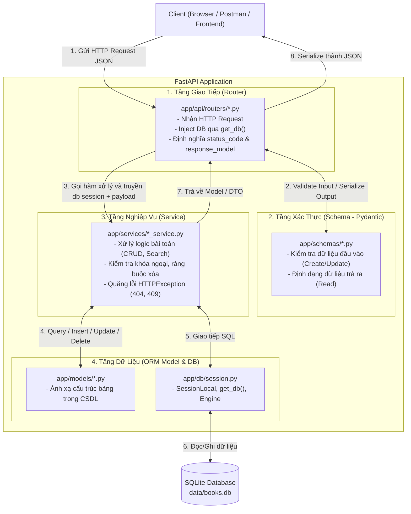
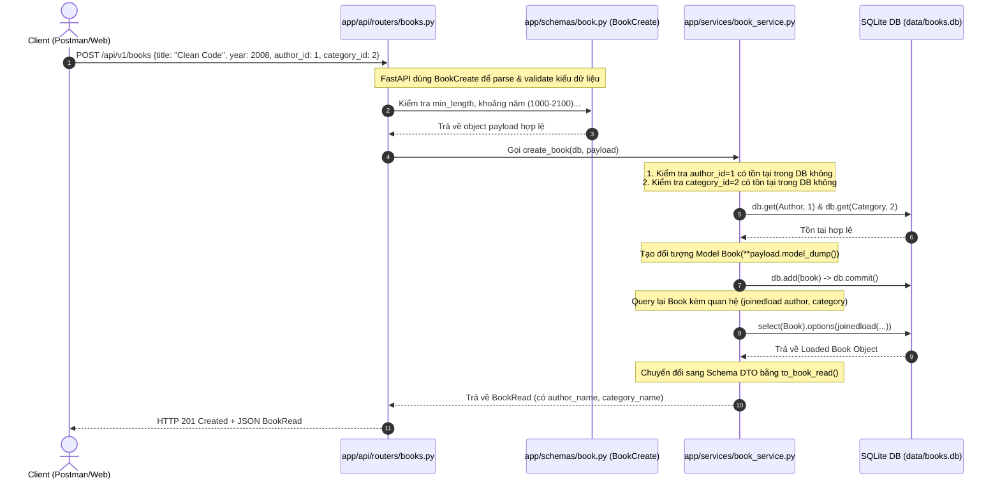
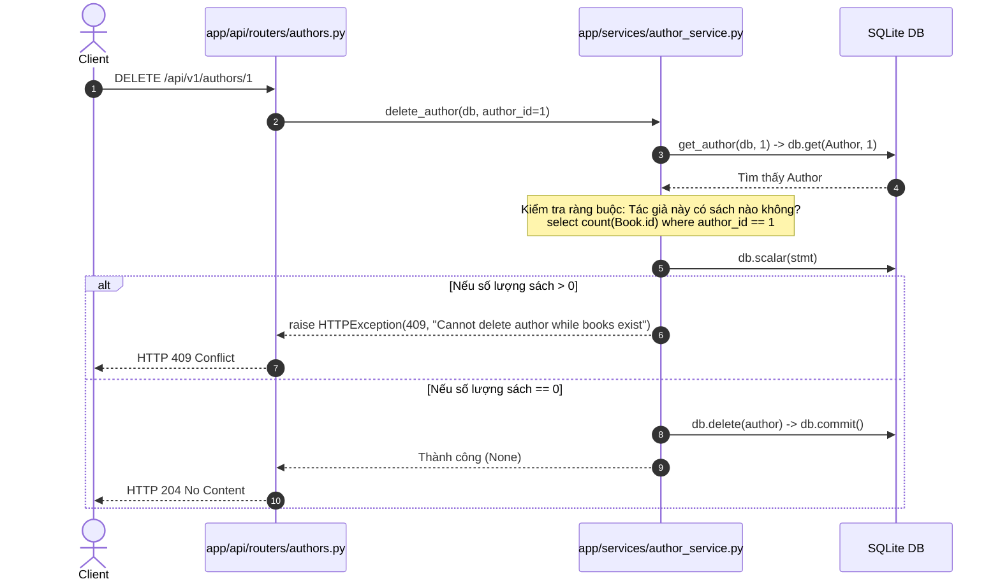
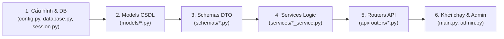

# TÀI LIỆU KIẾN TRÚC & LUỒNG HOẠT ĐỘNG DỰ ÁN FASTAPI (ARCHE.MD)

Tài liệu này được biên soạn dựa trên **mã nguồn thực tế** của dự án `training-week1` (Books API). Mục tiêu giúp bạn nắm trọn vẹn từ bức tranh tổng quan đến chi tiết từng dòng code: cách hoạt động, luồng request, liên kết giữa các tầng và thứ tự đọc code hiệu quả nhất cho người mới bắt đầu.

---

## MỤC LỤC
1. [Tổng Quan Dự Án](#1-tổng-quan-dự-án)
2. [Cấu Trúc Thư Mục Thực Tế](#2-cấu-trúc-thư-mục-thực-tế)
3. [Kiến Trúc Phân Tầng (Layered Architecture)](#3-kiến-trúc-phân-tầng-layered-architecture)
4. [Bản Đồ Liên Kết Giữa Các Tầng (Router - Schema - Service - Model - DB)](#4-bản-đồ-liên-kết-giữa-các-tầng)
5. [Chi Tiết Luồng Request Đi Qua Các File (Life of a Request)](#5-chi-tiết-luồng-request-đi-qua-các-file)
6. [Phân Biệt Cốt Lõi: Pydantic Schema vs SQLAlchemy Model](#6-phân-biệt-cốt-lõi-pydantic-schema-vs-sqlalchemy-model)
7. [Hướng Dẫn Thứ Tự Đọc Code Nhanh Hiểu Cho Người Mới](#7-hướng-dẫn-thứ-tự-đọc-code-nhanh-hiểu-cho-người-mới)
8. [Tổng Hợp Chi Tiết Từng Module](#8-tổng-hợp-chi-tiết-từng-module)

---

## 1. Tổng Quan Dự Án

### 1.1 Dự án này dùng để làm gì?
Đây là một ứng dụng Web API backend quản lý **Sách (Books)**, **Tác giả (Authors)** và **Danh mục thể loại (Categories)**, có tích hợp trang quản trị giao diện trực quan (**SQLAdmin Dashboard**).

### 1.2 Các chức năng chính:
- **Quản lý Tác giả (Authors CRUD)**: Thêm mới, xem danh sách, xem chi tiết, cập nhật, xóa tác giả (chặn xóa nếu tác giả đang có sách).
- **Quản lý Danh mục (Categories CRUD)**: Thêm mới, xem danh sách, xem chi tiết, cập nhật, xóa danh mục (chặn xóa nếu danh mục đang có sách).
- **Quản lý Sách (Books CRUD & Search)**:
  - Thêm, sửa, xóa, lấy chi tiết, lấy danh sách sách kèm tên tác giả và tên danh mục.
  - Lấy danh sách sách theo từng tác giả (`GET /api/v1/authors/{author_id}/books`).
  - Tìm kiếm sách nâng cao (`GET /api/v1/search/books`) theo: `author_id`, `category_id`, khoảng năm xuất bản `year_from` - `year_to`, và từ khóa tiêu đề `q`.
- **Trang Quản trị Admin (SQLAdmin UI)**: Giao diện web trực quan tại `/admin` để quản lý dữ liệu nhanh chóng mà không cần gọi API.
- **Tài liệu API tự động (Swagger/OpenAPI UI)**: Tra cứu và test trực tiếp tại `/docs` hoặc `/redoc`.

### 1.3 Công nghệ & Thư viện sử dụng (Dựa trên `requirements.txt`):
| Thư viện | Phiên bản | Vai trò |
| :--- | :--- | :--- |
| **FastAPI** | `>=0.115.0` | Web framework bất đồng bộ hiệu năng cao, tự sinh Swagger docs. |
| **Uvicorn** | `>=0.32.0` | ASGI Web Server chạy ứng dụng FastAPI. |
| **SQLAlchemy** | `>=2.0.0` | ORM (Object Relational Mapper) kết nối & thao tác với CSDL SQLite/PostgreSQL dạng đối tượng Python hiện đại (Mapped 2.0). |
| **Pydantic / Pydantic-Settings** | `>=2.0.0` | Quản lý cấu hình môi trường (.env) và Validate (kiểm tra kiểu, định dạng) dữ liệu Request/Response. |
| **SQLAdmin** | `>=0.20.0` | Giao diện Admin quản trị Database gắn trực tiếp vào FastAPI. |
| **Alembic** | `>=1.14.0` | Công cụ theo dõi và quản lý phiên bản database (Database Migrations). |

### 1.4 Entry Point & Trình tự khởi động ứng dụng:
- **Entry Point**: Lệnh chạy `uvicorn app.main:app --reload`.
- **Trình tự thực thi khi khởi chạy (`app/main.py`)**:
  1. Nạp cấu hình: `settings = get_settings()` (đọc từ `app/core/config.py`).
  2. Khởi tạo FastAPI app: `app = FastAPI(title=settings.app_title)`.
  3. Khởi tạo bảng CSDL: `Base.metadata.create_all(bind=engine)` tạo các bảng SQLite trong `data/books.db` nếu chưa tồn tại.
  4. Đăng ký Admin UI: `setup_admin(app, engine)` (đăng ký các view Author, Book, Category vào `/admin`).
  5. Đăng ký các Router API: gắn các router `authors`, `books`, `categories` với tiền tố `/api/v1`.
  6. Server Uvicorn lắng nghe kết nối tại cổng mặc định `http://127.0.0.1:8000`.

---

## 2. Cấu Trúc Thư Mục Thực Tế

```text
training-week1/
├── alembic/                       # Thư mục cấu hình và lịch sử migration CSDL
│   ├── versions/                  # Chứa các file kịch bản nâng cấp CSDL qua từng thời kỳ
│   │   ├── 8c290d3404a6_baseline.py         # Migration tạo bảng authors, books ban đầu
│   │   ├── 199f4d30f954_add_categories.py   # Migration thêm bảng categories
│   │   └── b27fdd07653f_add_book_category_id.py # Migration thêm cột category_id vào books
│   ├── env.py                     # Cấu hình kết nối Alembic với SQLAlchemy Base và Models
│   └── script.py.mako             # Template sinh mã migration tự động
├── alembic.ini                    # File thiết lập cấu hình của công cụ Alembic
├── app/                           # MÃ NGUỒN CHÍNH CỦA ỨNG DỤNG
│   ├── __init__.py                # Khai báo app là một Python Package
│   ├── main.py                    # Entry Point: Khởi tạo FastAPI, mount router, DB, Admin
│   ├── admin.py                   # Cấu hình giao diện SQLAdmin (AuthorAdmin, BookAdmin, CategoryAdmin)
│   ├── api/                       # TẦNG GIAO TIẾP NGOẠI VI (API CONTROLLERS)
│   │   ├── __init__.py
│   │   └── routers/               # Định nghĩa các endpoint URL
│   │       ├── __init__.py
│   │       ├── authors.py         # Router cho tác giả (/api/v1/authors)
│   │       ├── books.py           # Router cho sách (/api/v1/books, /api/v1/search/books, ...)
│   │       └── categories.py      # Router cho danh mục (/api/v1/categories)
│   ├── core/                      # CẤU HÌNH HỆ THỐNG
│   │   ├── __init__.py
│   │   └── config.py              # Đọc biến môi trường (.env) bằng Pydantic BaseSettings
│   ├── db/                        # KẾT NỐI VÀ QUẢN LÝ DATABASE
│   │   ├── __init__.py
│   │   ├── database.py            # Khai báo Base (DeclarativeBase) và DATABASE_URL
│   │   └── session.py             # Khởi tạo engine, SessionLocal và dependency get_db()
│   ├── models/                    # TẦNG DỮ LIỆU CƠ SỞ DỮ LIỆU (SQLALCHEMY ORM MODELS)
│   │   ├── __init__.py            # Export Author, Book, Category
│   │   ├── author.py              # Model bảng 'authors'
│   │   ├── book.py                # Model bảng 'books' (quan hệ với Author và Category)
│   │   └── category.py            # Model bảng 'categories'
│   ├── schemas/                   # TẦNG KIỂM TRA ĐỊNH DẠNG & VALIDATION DỮ LIỆU (PYDANTIC)
│   │   ├── __init__.py
│   │   ├── author.py              # AuthorCreate, AuthorUpdate, AuthorRead
│   │   ├── book.py                # BookCreate, BookUpdate, BookRead
│   │   └── category.py            # CategoryCreate, CategoryUpdate, CategoryRead
│   └── services/                  # TẦNG NGHIỆP VỤ (BUSINESS LOGIC & DATABASE QUERIES)
│       ├── __init__.py
│       ├── author_service.py      # Logic CRUD Tác giả + kiểm tra ràng buộc sách
│       ├── book_service.py        # Logic CRUD Sách + eager load quan hệ + tìm kiếm
│       └── category_service.py    # Logic CRUD Danh mục + kiểm tra ràng buộc sách
├── data/                          # Nơi lưu file database SQLite
│   └── books.db                   # File database SQLite thực tế
├── requirements.txt               # Danh sách thư viện phụ thuộc của Python
├── README.md                      # Hướng dẫn chạy dự án
├── Arche.md                       # Tài liệu kiến trúc toàn diện này
├── test_authors.http              # HTTP Client scripts để test API Authors
├── test_category.http             # HTTP Client scripts để test API Categories
├── test_bai6_delete.http          # HTTP Client scripts để test logic ràng buộc xóa
└── test_bai7_search_book.http     # HTTP Client scripts để test logic tìm kiếm sách
```

---

## 3. Kiến Trúc Phân Tầng (Layered Architecture)

Project được tổ chức theo chuẩn **Separation of Concerns (Phân tách mối quan tâm)** gồm 4 tầng chính:



---

## 4. Bản Đồ Liên Kết Giữa Các Tầng

Dưới đây là bảng tra cứu chính xác các file tương ứng trong từng chức năng:

| Chức năng | Router (Nhận request) | Schema (Validate DTO) | Service (Xử lý logic) | Model (Bảng CSDL) |
| :--- | :--- | :--- | :--- | :--- |
| **Tác giả (Authors)** | `app/api/routers/authors.py` | `app/schemas/author.py` | `app/services/author_service.py` | `app/models/author.py` |
| **Sách (Books)** | `app/api/routers/books.py` | `app/schemas/book.py` | `app/services/book_service.py` | `app/models/book.py` |
| **Danh mục (Categories)** | `app/api/routers/categories.py` | `app/schemas/category.py` | `app/services/category_service.py` | `app/models/category.py` |
| **Quản trị (Admin)** | `app/admin.py` | *(Dùng trực tiếp Model)* | *(SQLAdmin tự xử lý)* | `app/models/*.py` |
| **Kết nối CSDL** | `app/db/session.py` (`get_db`) | - | `Session` (SQLAlchemy) | `app/db/database.py` (`Base`) |

---

## 5. Chi Tiết Luồng Request Đi Qua Các File

Hãy cùng theo dõi 2 ví dụ thực tế cụ thể để thấy rõ **dữ liệu được truyền qua các file như thế nào**.

### Ví dụ 1: Luồng Tạo Sách Mới (`POST /api/v1/books`)



### Chi tiết từng bước code chạy:
1. **Client**: Gửi HTTP POST với body JSON `{ "title": "Clean Code", "year": 2008, "author_id": 1, "category_id": 2 }`.
2. **`app/main.py`**: Định tuyến request có tiền tố `/api/v1` sang `app/api/routers/books.py`.
3. **`app/api/routers/books.py`**:
   - `Depends(get_db)` mở một phiên làm việc CSDL (`Session`) từ `app/db/session.py`.
   - FastAPI tự động dùng `BookCreate` (trong `app/schemas/book.py`) để kiểm tra dữ liệu. Nếu sai (ví dụ `year = 999`), FastAPI trả về ngay lỗi 422 Unprocessable Entity.
   - Khi dữ liệu hợp lệ, hàm `create_book(payload, db)` gọi tiếp `book_service.create_book(db, payload)`.
4. **`app/services/book_service.py`**:
   - Gọi `_ensure_author_exists(db, payload.author_id)`: Nếu `author_id` không có trong bảng `authors`, văng lỗi `HTTPException(404, "Author not found")`.
   - Gọi `_ensure_category_exists(db, payload.category_id)`: Nếu `category_id` không có trong bảng `categories`, văng lỗi `HTTPException(404, "Category not found")`.
   - Tạo instance của Model `Book` (`app/models/book.py`) từ `payload.model_dump()`.
   - Lưu vào DB: `db.add(book)` -> `db.commit()`.
   - Query lại với kỹ thuật **Eager Loading** (`joinedload(Book.author)`, `joinedload(Book.category)`) để lấy được thông tin tên tác giả và danh mục mà không bị lỗi lazy-loading.
   - Biến đổi sang `BookRead` thông qua hàm helper `to_book_read()`.
5. **Đóng Session**: Sau khi hoàn thành request, generator trong `get_db()` (`app/db/session.py`) nhảy vào block `finally:` và thực hiện `db.close()`.

---

### Ví dụ 2: Luồng Xóa Tác Giả Có Ràng Buộc Nghiệp Vụ (`DELETE /api/v1/authors/{id}`)



---

## 6. Phân Biệt Cốt Lõi: Pydantic Schema vs SQLAlchemy Model

Đây là điểm mà người mới học FastAPI rất hay nhầm lẫn:

| Tiêu chí | Pydantic Schema (`app/schemas/`) | SQLAlchemy Model (`app/models/`) |
| :--- | :--- | :--- |
| **Kế thừa từ** | `pydantic.BaseModel` | `app.db.database.Base` (DeclarativeBase) |
| **Nhiệm vụ chính** | **Validate** dữ liệu gửi lên và **Format** dữ liệu JSON trả về cho Client. | **Ánh xạ (Mapping)** bảng dữ liệu thực tế trong Database. |
| **Vị trí hoạt động** | Tầng biên (giao tiếp giữa Client & Router). | Tầng lõi dữ liệu (giao tiếp giữa Service & CSDL). |
| **Ví dụ trong bài** | `BookCreate` (yêu cầu title, year), `BookRead` (chứa cả `author_name`, `category_name`). | `Book` (chứa các cột `id`, `title`, `year`, `author_id`, `category_id` và các quan hệ `relationship`). |
| **Cấu hình đặc biệt** | `model_config = {"from_attributes": True}` (giúp tự chuyển đổi từ ORM Model sang Schema). | `__tablename__ = "books"`, `mapped_column()`, `relationship()`. |

---

## 7. Hướng Dẫn Thứ Tự Đọc Code Nhanh Hiểu Cho Người Mới

Để hiểu toàn bộ project một cách tự nhiên và có hệ thống, bạn nên đọc code theo **6 bước** sau:



### Chi tiết từng bước:
1. **Bước 1: Nền tảng kết nối (`app/core/config.py` ➔ `app/db/database.py` ➔ `app/db/session.py`)**
   - Xem cấu hình lấy biến môi trường từ đâu.
   - Xem cách khởi tạo `Base` của SQLAlchemy và `engine`, `SessionLocal`, hàm cung cấp session `get_db()`.
2. **Bước 2: Cấu trúc cơ sở dữ liệu (`app/models/author.py`, `category.py`, `book.py`)**
   - Hiểu bảng nào liên kết với bảng nào qua khóa ngoại `ForeignKey` và `relationship`.
   - Quan hệ: `Author` (1) - (N) `Book`, `Category` (1) - (N) `Book`.
3. **Bước 3: Hợp đồng dữ liệu Request/Response (`app/schemas/author.py`, `category.py`, `book.py`)**
   - Xem `Create` cần những trường gì, điều kiện validate ra sao (ví dụ: `min_length=1`, `ge=1000, le=2100`).
   - Xem `Read` trả về những dữ liệu gì cho người dùng.
4. **Bước 4: Logic nghiệp vụ (`app/services/author_service.py`, `category_service.py`, `book_service.py`)**
   - Đọc các câu lệnh truy vấn SQLAlchemy (`select`, `where`, `joinedload`, `order_by`).
   - Xem cách kiểm tra dữ liệu tồn tại, bắt lỗi logic (chặn xóa khi đang có sách).
5. **Bước 5: Điểm tiếp nhận API (`app/api/routers/authors.py`, `categories.py`, `books.py`)**
   - Xem cách gắn method HTTP (`@router.get`, `@router.post`, `@router.put`, `@router.delete`).
   - Xem cách nhận tham số từ URL Path, Query Params, Body và cách inject `db: Session = Depends(get_db)`.
6. **Bước 6: Tổng hợp toàn hệ thống (`app/main.py` & `app/admin.py`)**
   - Xem cách nhúng tất cả các router vào ứng dụng chính với prefix `/api/v1`.
   - Xem cách cấu hình trang quản trị Admin trực quan.

---

## 8. Tổng Hợp Chi Tiết Từng Module

### 8.1 Module Tác Giả (Authors)
- **Model**: `id`, `name`, `bio`, `country`, `birth_year`. Quan hệ `books` trỏ tới `Book`.
- **Logic đặc biệt**:
  - Không cho phép xóa tác giả nếu đang có bất kỳ cuốn sách nào liên kết (`author_service.delete_author` đếm số sách bằng `func.count(Book.id)`).

### 8.2 Module Danh Mục (Categories)
- **Model**: `id`, `name`. Quan hệ `books` trỏ tới `Book`.
- **Logic đặc biệt**:
  - Không cho phép xóa danh mục nếu đang có bất kỳ cuốn sách nào liên kết (`category_service.delete_category` đếm số sách có `category_id`).

### 8.3 Module Sách (Books)
- **Model**: `id`, `title`, `year`, `summary`, `author_id` (FK `authors.id`), `category_id` (FK `categories.id`).
- **Logic đặc biệt**:
  - **Kiểm tra tồn tại**: Khi tạo hoặc sửa sách, service tự động kiểm tra `author_id` và `category_id` có tồn tại hay không trước khi lưu.
  - **Eager Loading**: Khi lấy danh sách/chi tiết, service dùng `options(joinedload(Book.author), joinedload(Book.category))` giúp nạp trước thông tin tác giả và danh mục trong 1 câu truy vấn SQL duy nhất.
  - **Tìm kiếm linh hoạt (`search_books`)**: Ghép nối linh hoạt các mệnh đề `where` theo từng điều kiện `author_id`, `category_id`, khoảng năm `year_from` / `year_to`, và tìm kiếm không phân biệt chữ hoa/thường `Book.title.ilike(...)`.

### 8.4 Module Admin (`app/admin.py`)
- Sử dụng thư viện `SQLAdmin` gắn trực tiếp vào FastAPI app và engine SQLAlchemy.
- Cấu hình 3 view: `AuthorAdmin`, `BookAdmin`, `CategoryAdmin` với danh sách cột hiển thị rõ ràng, giúp thêm/sửa/xóa trực tiếp trên trình duyệt tại `http://127.0.0.1:8000/admin`.
