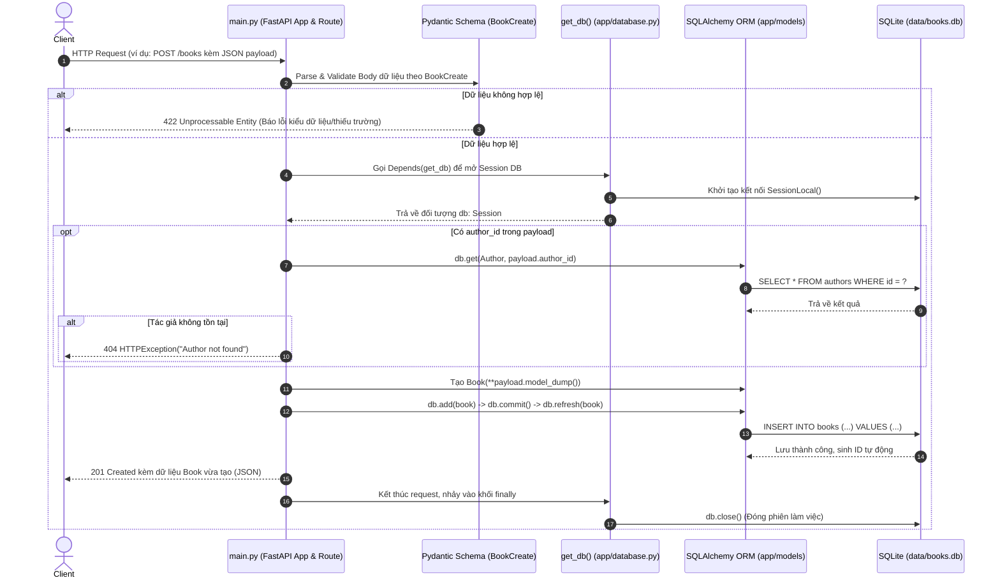

# KIẾN TRÚC & LUỒNG HOẠT ĐỘNG DỰ ÁN WEEK1-FASTAPI

Tài liệu này phân tích chi tiết toàn bộ mã nguồn thực tế của dự án **`week1-fastapi`**, giúp người mới học FastAPI nắm bắt được:
1. Tổng quan dự án, công nghệ và điểm khởi chạy (Entry Point).
2. Cấu trúc thư mục và vai trò cụ thể của từng file.
3. Luồng đi của Request từ Client đến Database và ngược lại.
4. Mối quan hệ giữa Database, Model, Schema, Admin UI và API Route.
5. Hướng dẫn lộ trình đọc code tối ưu nhất.

---

## 1. Tổng quan Project

- **Mục đích dự án**: Xây dựng một RESTful API quản lý Sách (`Book`) và Tác giả (`Author`), kết hợp trang quản trị trực quan (Admin Dashboard) và cơ chế quản lý phiên bản cơ sở dữ liệu (Database Migration).
- **Chức năng chính**:
  - API CRUD Sách (Tạo mới, Lấy danh sách, Lấy chi tiết, Cập nhật, Xóa).
  - Kiểm tra ràng buộc khoá ngoại (khi thêm/sửa Sách, kiểm tra `author_id` có tồn tại trong bảng `authors` không).
  - Giao diện Admin quản trị dữ liệu trực tiếp tại đường dẫn `/admin` thông qua thư viện `sqladmin`.
  - Quản lý và đồng bộ cấu trúc bảng cơ sở dữ liệu tự động thông qua `alembic`.
- **Công nghệ & Thư viện sử dụng**:
  - **FastAPI**: Web framework chính để định nghĩa API endpoints, quản lý Request/Response, Dependency Injection.
  - **Pydantic (v2)**: Định nghĩa Schemas (`BookCreate`, `AuthorCreate`) để validate dữ liệu đầu vào.
  - **SQLAlchemy (v2 ORM)**: Tương tác với CSDL SQLite qua ORM Models (`DeclarativeBase`, `Mapped`, `mapped_column`).
  - **SQLAdmin**: Tạo giao diện Admin Dashboard quản lý Model `Book` và `Author`.
  - **Alembic**: Công cụ Migration để tạo bảng, cập nhật schema cơ sở dữ liệu SQLite (`books.db`).
  - **SQLite**: Cơ sở dữ liệu quan hệ dạng file lưu trữ tại `data/books.db`.
  - **Uvicorn**: ASGI server dùng để chạy ứng dụng FastAPI.

### Entry Point & Quá trình khởi chạy (Execution Start)
- **Entry Point**: File `main.py`.
- **Lệnh chạy thông thường**: `uvicorn main:app --reload`
- **Khi ứng dụng bắt đầu khởi chạy, thứ tự thực thi diễn ra như sau**:
  1. Python nạp file `main.py`.
  2. Nạp các module phụ thuộc:
     - `app.database`: Tạo thư mục `data/`, khởi tạo `engine`, `SessionLocal`, lớp `Base`, hàm `get_db`.
     - `app.models`: Nạp model `Author` và `Book` kế thừa từ `Base`.
     - `app.admin`: Nạp cấu hình view `AuthorAdmin`, `BookAdmin` và hàm `setup_admin`.
  3. Khởi tạo đối tượng `app = FastAPI(title="Books API")`.
  4. Gọi `setup_admin(app, engine)`: Gắn Admin dashboard vào `app` tại route `/admin`.
  5. Đăng ký các Pydantic Schemas (`AuthorCreate`, `BookCreate`).
  6. Đăng ký các API Routes (`/`, `/books`, `/books/{book_id}`) vào đối tượng `app`.
  7. Server Uvicorn lắng nghe HTTP requests tại cổng mặc định `http://127.0.0.1:8000`.

---

## 2. Cấu trúc thư mục & Giải thích từng file

```text
week1-fastapi/
├── alembic.ini                   # File cấu hình gốc của Alembic (chỉ định đường dẫn thư mục migration, logging, db url)
├── alembic/                      # Thư mục chứa mã nguồn quản lý Database Migration
│   ├── env.py                    # Script môi trường kết nối Alembic với SQLAlchemy Models (Base.metadata) & DB Engine
│   ├── script.py.mako            # Template file để sinh ra các file migration mới
│   └── versions/                 # Chứa các file phiên bản migration đã sinh ra
│       └── 347337463b8a_init_database.py  # File migration khởi tạo 2 bảng `authors` và `books`
├── app/                          # Gói module chính của ứng dụng
│   ├── __init__.py               # Đánh dấu `app` là một Python package
│   ├── database.py               # Thiết lập kết nối SQLite, Engine, SessionLocal, Base, và Dependency `get_db`
│   ├── admin.py                  # Cấu hình giao diện Admin (SQLAdmin) cho Author và Book
│   └── models/                   # Thư mục chứa các SQLAlchemy ORM Models
│       ├── __init__.py           # Export Author và Book để dễ dàng import từ `app.models`
│       ├── author.py             # Định nghĩa cấu trúc bảng CSDL `authors` (id, name)
│       └── book.py               # Định nghĩa cấu trúc bảng CSDL `books` (id, title, year, summary, author_id)
├── data/                         # Thư mục chứa file CSDL
│   └── books.db                  # File SQLite Database lưu trữ dữ liệu thực tế
├── main.py                       # File trung tâm (Entry point): khởi tạo FastAPI, schemas, routes và kết nối các thành phần
└── Arche.md                      # Tài liệu giải thích kiến trúc và luồng hoạt động của dự án
```

### Chi tiết chức năng từng file:

1. **`app/database.py`**:
   - Xác định đường dẫn file CSDL: `data/books.db`. Tự động tạo thư mục `data/` nếu chưa có.
   - `engine`: Cầu nối kết nối giữa SQLAlchemy và SQLite (`check_same_thread=False` hỗ trợ đa luồng trong FastAPI).
   - `SessionLocal`: Session factory dùng để tạo các phiên làm việc (Session) với DB.
   - `Base`: Lớp cơ sở kế thừa `DeclarativeBase` để các model khai báo bảng.
   - `get_db()`: Generator function dùng làm Dependency trong FastAPI (`Depends(get_db)`), mở session khi có request và tự động `close()` khi request xử lý xong.

2. **`app/models/author.py`**:
   - Định nghĩa model `Author` đại diện cho bảng `authors`.
   - Các cột: `id` (Khóa chính, Integer), `name` (String 200 ký tự, không null).

3. **`app/models/book.py`**:
   - Định nghĩa model `Book` đại diện cho bảng `books`.
   - Các cột: `id` (Khóa chính, Integer), `title` (String 200 ký tự), `year` (Integer), `summary` (String 500 ký tự, có thể null), `author_id` (Khóa ngoại trỏ đến `authors.id`, có thể null).

4. **`app/models/__init__.py`**:
   - Import `Author` từ `app.models.author` và `Book` từ `app.models.book`.
   - Giúp các file khác chỉ cần gọi `from app.models import Book, Author`.

5. **`app/admin.py`**:
   - Sử dụng thư viện `sqladmin` để tạo giao diện web admin.
   - `AuthorAdmin` & `BookAdmin`: Khai báo các cột hiển thị trên bảng quản trị.
   - `setup_admin(app, engine)`: Gắn trang quản trị vào ứng dụng FastAPI (`/admin`).

6. **`main.py`**:
   - Khởi tạo FastAPI application: `app = FastAPI(...)`.
   - Gắn admin dashboard: `setup_admin(app, engine)`.
   - Định nghĩa Pydantic schemas: `AuthorCreate`, `BookCreate` để validate dữ liệu gửi lên.
   - Định nghĩa các API endpoints (Root, GET all books, GET book by id, POST book, PUT book, DELETE book).
   - *Lưu ý về kiến trúc code hiện tại*: Trong project này, các schema và router được đặt trực tiếp trong `main.py` để giữ cấu trúc nhỏ gọn và dễ quan sát.

7. **`alembic/env.py` & Migration files**:
   - `env.py` liên kết `target_metadata = Base.metadata` và sử dụng `engine` từ `app.database`.
   - Giúp Alembic tự động phát hiện các thay đổi trong `app/models/` để sinh script tạo/sửa bảng CSDL mà không làm mất dữ liệu.

---

## 3. Luồng xử lý Request (Request Lifecycle)

Khi một Client (Trình duyệt, Postman, Frontend) gửi một HTTP Request đến API, luồng đi qua các tầng như sau:



### Chi tiết các bước dữ liệu đi qua:
1. **Tiếp nhận & Định tuyến**: `main.py` tiếp nhận request từ URL và phương thức HTTP (GET/POST/PUT/DELETE).
2. **Validation**: Pydantic schema (`BookCreate`) tự động kiểm tra định dạng dữ liệu (ví dụ `year` phải là `int`, `title` phải là `str`).
3. **Cung cấp phiên CSDL (Dependency Injection)**: FastAPI thực thi `get_db()`, mở kết nối `db: Session` an toàn và truyền vào controller.
4. **Xử lý nghiệp vụ (Business Logic)**:
   - Kiểm tra logic khoá ngoại: Nếu sách có `author_id`, truy vấn bảng `authors` xem có tồn tại không.
   - Thao tác ORM: Thêm (`db.add`), cập nhật (`setattr`), xóa (`db.delete`), hoặc truy vấn (`db.get`, `db.query`).
5. **Ghi xuống CSDL**: Gọi `db.commit()` để lưu thay đổi vào `data/books.db`, và `db.refresh()` để nạp lại dữ liệu mới nhất (gồm cả `id` tự tăng).
6. **Trả về kết quả & Dọn dẹp tài nguyên**: FastAPI serialize đối tượng trả về dạng JSON cho Client, đồng thời khối `finally` trong `get_db()` thực hiện `db.close()`.

---

## 4. Bảng liên kết & Luồng dữ liệu giữa các thành phần

| Thành phần | File đảm nhiệm | Vai trò & Cách liên kết |
| :--- | :--- | :--- |
| **Database Engine & Session** | `app/database.py` | Tạo kết nối tới `data/books.db`. Cung cấp `engine` cho Admin/Alembic và `get_db` cho Router. |
| **ORM Models** | `app/models/author.py`<br>`app/models/book.py` | Kế thừa từ `Base` (`app/database.py`). Ánh xạ thành các bảng `authors`, `books` trong SQLite. |
| **Validation Schemas** | `main.py` (`BookCreate`, `AuthorCreate`) | Định dạng dữ liệu Client gửi lên, kiểm tra kiểu dữ liệu trước khi chuyển đổi sang ORM Model. |
| **Admin Dashboard** | `app/admin.py` | Sử dụng Model (`Author`, `Book`) và `engine` để tạo trang giao diện quản trị tại `/admin`. |
| **API Endpoints** | `main.py` | Nhận request, dùng `Depends(get_db)`, validate qua Schema, thao tác với Model và trả về JSON. |
| **Migration** | `alembic/env.py`<br>`alembic/versions/` | Đọc `Base.metadata` chứa thông tin các Model để quản lý phiên bản bảng trong CSDL. |

---

## 5. Lộ trình đọc hiểu dự án nhanh nhất cho người mới

Nếu bạn mới bắt đầu đọc codebase này, hãy đọc theo thứ tự 6 bước sau để nắm bắt tự nhiên và logic nhất:

1. **Bước 1: `app/database.py`**
   - *Mục tiêu*: Hiểu cách ứng dụng kết nối tới SQLite, cách tạo `Base` cho Models và cơ chế cấp phát kết nối `get_db()`.
2. **Bước 2: `app/models/author.py` & `app/models/book.py`**
   - *Mục tiêu*: Hiểu cấu trúc bảng dữ liệu (Entity), các trường thông tin và quan hệ khoá ngoại `books.author_id -> authors.id`.
3. **Bước 3: `app/models/__init__.py`**
   - *Mục tiêu*: Hiểu cách gom nhóm import model để tái sử dụng ở các module khác.
4. **Bước 4: `app/admin.py`**
   - *Mục tiêu*: Xem cách gắn giao diện trực quan vào FastAPI để quản lý dữ liệu nhanh chóng mà không cần viết giao diện riêng.
5. **Bước 5: `main.py`**
   - *Mục tiêu*: Xem toàn bộ bức tranh: từ Schema Pydantic, Dependency `get_db`, đến logic kiểm tra và xử lý CRUD cho từng endpoint.
6. **Bước 6: `alembic/env.py` & `alembic/versions/`**
   - *Mục tiêu*: Hiểu cách cơ sở dữ liệu được tạo ra và nâng cấp tự động qua migrations thay vì tạo bảng thủ công.

---
*Tài liệu được sinh tự động dựa trên phân tích toàn bộ mã nguồn thực tế của dự án `week1-fastapi`.*
